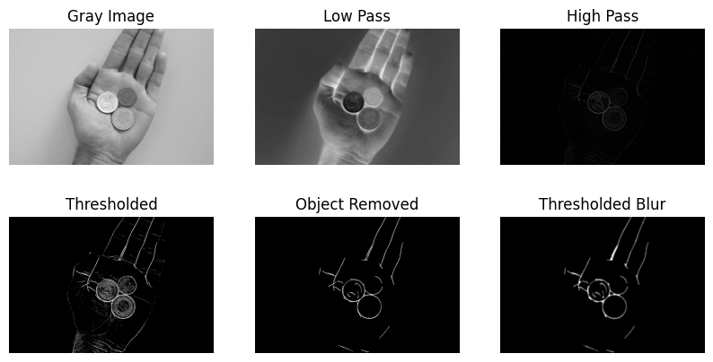
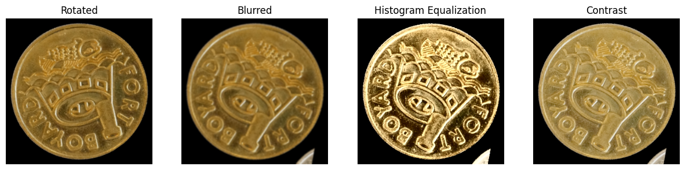

<div align="center">

</div>

<div align="center">
Ecole Polytechnique Fédérale de Lausanne
</div> 
<div align="center">
EE-451: Image Analysis and Pattern Recognition
</div> 

# Coin Challenge

## Table of Contents

- [Abstract](#abstract)
- [Project Structure](#project-structure)
- [Dataset Structure](#dataset-structure)
- [Data Processing](#data-processing)
- [Models](#models)
- [Environment](#environment)
- [Results](#results)
- [Run the solution](#run-the-solution)

## Abstract 
The purpose of this project is to detect coins on a given image. Several backgrounds are present in the images. Their types are:
- neutral background
- hand background
- noisy backgroud
  
In order to detect efficiently the coins, preprocessing tasks have to be performed before doing classification. These tasks involve thresholding, morphology and edge detection. For the classification part, several model have been tested, showing reasonably good performance. The results of the differents models are summarized in the [Results](#results) section.

## Project structure
The project has the following structure:
```
.
├── LICENSE
├── README.md
├── data
│   ├── coin_labels_complete.xlsx
│   ├── ref
│   │   ├── ref_chf.JPG
│   │   └── ref_eur.JPG
│   ├── results
│   │   ├── ref
│   │   ├── test
│   │   └── train
│   ├── test
│   │   ├── L0000000.JPG
│   │   ├── ...
│   │   └── L0000161.JPG
│   ├── train
│   │   ├── 1. neutral_bg
│   │   ├── 2. noisy_bg
│   │   ├── 3. hand
│   │   ├── 4. neutral_bg_outliers
│   │   ├── 5. noisy_bg_outliers
│   │   └── 6. hand_outliers
│   └── train_labels.csv
├── documents
│   ├── ee451_presentation.pdf
│   └── ee451_project_description.pdf
├── environment.yml
├── environment_windows.yml
├── models
│   ├── Advanced_CNN_300
│   ├── Basic_CNN_300
│   └── Efficient_net_300
├── resources
│   ├── augmentation.png
│   ├── logo-epfl.png
│   ├── masked_img.png
│   └── processing_steps.png
├── src
│   ├── constants.py
│   ├── data_classes
│   │   ├── data.py
│   │   ├── ref_data.py
│   │   ├── test_data.py
│   │   └── train_data.py
│   ├── main.ipynb
│   ├── models
│   │   ├── cnn.py
│   │   └── efficient_net.py
│   ├── pickle_func.py
│   ├── post_processing
│   │   ├── data_augmentation.py
│   │   ├── data_formating.py
│   │   ├── dataloader.py
│   │   ├── datasets.py
│   │   └── submission.py
│   ├── pre_processing
│   │   ├── feature_extraction.py
│   │   ├── morphology.py
│   │   └── process_func.py
│   ├── run.py
│   └── visualization.py
└── submissions
    ├── advanced_radius_300.csv
    ├── results.xlsx
    ├── submission.csv
    ├── submission_300_basic.csv
    ├── submission_advanced_300.csv
    ├── submission_advanced_400.csv
    ├── submission_advanced_radius.csv
    ├── submission_basic_cnn.csv
    ├── submission_efficient_net_300.csv
    └── submission_from_run.csv
```

The `src` folder contains all the code needed to perform a submission for the [Kaggle Challenge](https://www.kaggle.com/competitions/iapr24-coin-counter). 

## Dataset Structure
```
.
├── ref
│   ├── ref_chf.JPG
│   └── ref_eur.JPG
├── test
│   ├── L0000000.JPG
│   ├── ...
│   └── L0000161.JPG
├── train
│   ├── 1. neutral_bg
│   │   ├── L1010277.JPG
│   │   ├── ...
│   │   └── L1010323.JPG
│   ├── 2. noisy_bg
│   │   ├── L1010325.JPG
│   │   ├── ...
│   │   └── L1010370.JPG
│   ├── 3. hand
│   │   ├── L1010373.JPG
│   │   ├── ...
│   │   └── L1010395.JPG
│   ├── 4. neutral_bg_outliers
│   │   ├── L1010405.JPG
│   │   ├── ...
│   │   └── L1010454.JPG
│   ├── 5. noisy_bg_outliers
│   │   ├── L1010462.JPG
│   │   ├── ...
│   │   └── L1010503.JPG
│   └── 6. hand_outliers
│       ├── L1010506.JPG
│       ├── ...
│       └── L1010524.JPG
└── train_labels.csv
```

In order to efficiently use the code, the structure is recommanded for the data. Furthermore, the folder `data` must be put according to the [Project Structure](#project-structure).

## Data Processing
### Finding the coins
The next part of the process is to detect the coins in the different images and create a single image for each coin. The class function **proceed_data** does the whole analysis. This analysis can be decomposed into several parts.

1. Finding contours:  
   The first step of the process is to find the contours. In order to effectively detect the contours, depending on the background properties, these steps are performed:
   - First of all, the image is reshaped (1/4) in order to accelerate the computation time. 1/4 was a good compromise between speed and image quality.
   - In order to distinguish the backgrounds, the standard deviation of the image is calculated. Conditions on this threshold are then set. The idea behind using the standard deviation is that the higher the standard deviation is, the more filtered the image should be. As the different backgrounds (neutral, hand, and noisy) have different structuring elements, this aims to be a good choice. To differentiate between the hand and the noisy background, the standard deviation of the contours is used: the noisy background will create a lot of small contours, while the hand will create fewer, resulting in a difference in standard deviation.
   - To find the contours itselfs, the images are then converted into grayscale. A lowpass filter (Gaussian blur) is then applied in order to reduce the noise in the image. A high pass is also created and applied to the image. The image is then thresholded on the resulting image.
   - Morphology is applied in order to clean the image and make it easier to detect the coins. First, small objects are removed and then a closing is done. 
   - The last step is to find the contours (using cv.HoughCircles). 

   This process gives very good results (1 coin is not detected in the train set (superposed coins) and two are not detected in the test set)

2. Create the masked images:
   Now that the coins are efficiently detected, a masked image is created on the original image. This is done in order to have a perfect contours on the coins. These masked images are again stored both as a dictionary (attribute of the class) and as a tuple in order to save informations about the image. These tuples have the following shape: \
   `(image_name, coin_name, contour)` \
   for instance:\
   `('L1010410', 'L1010410_0', array([812.5, 582.5,  53.6], dtype=float32))`. 
3. The last step of the process is to crop the coins. For each image, coins are detoured and return a croped image of variable shape. These croped images are stored as an array.

<p align="center">

<p>

### Labelisation
Now that the images have been segmented, each coin must be associated with its corresponding label. However, due to the use of Weak Supervision in the train labels (train_labels.csv), direct assignment of coins to their respective classes is not feasible.

One possible approach is manual labeling of the entire training set. Given the relatively low number of training samples (less than 400 samples), manual labeling is a viable option. Initially, this method was employed in the project to facilitate subsequent tasks such as classifier construction. However, it's important to note the inherent limitations of this technique. With a larger number of samples, the time and effort required for manual labeling would become prohibitively high, rendering it impractical. Consequently, alternative strategies need to be explored.

### Data Augmentation
The next step before classification is to separate the training values into training and validation sets. The ratio is set in the **constants.py** file.

Data augmentation is also performed to improve the results and expand the training set. Several methods have been used:
- **Rotations**: Rotations are applied to ensure the model can recognize coins from every direction.
- **Gaussian Blur**: With a certain probability, Gaussian blur is applied to images to enhance the model's robustness.
- **Gamma Correction**: This augmentation is used to correct the difference in luminosity in the image. 
    - Gamma > 1: Darkens the image.
    - Gamma < 1: Brightens the image.
- **Histogramm Equalization** : This augmentation standardizes the pixel color distribution across the grayscale spectrum.
<p align="center">

</P>


### Classification
To perform the classification, a neural network has been chosen. More precisely a Convolutional Neural Network has been chosen. This kind of neural network has shown very high performance for computer vision tasks. For this projects, several models are proposed. They are presented in the next section.

## Models
1. **Basic CNN**: This first approach consists of a basic CNN wiht only few layers (details can be found under ./src/models/cnn.py). 
2. **Advanced CNN**: The second model is a more elaborated CNN model, with multiple layers. 
3. **Advanced CNN with Radius Informations**: In this approach, the same CNN as in point 2 has been used, but before the fully connected layer, the information of the radius has been inserted. 
4. **Efficient-net**: A last approach is to use a pre-trained model. This model has been trained on ImageNet 1k.

## Results

Different techniques have been used to boost the performances of the classifier, involving:
- including the radius
- changing the size of the input image
- performing different data augmentation

All the results are summarized in the table below


| Model         | Radius | Image Size | Data Augmentation | F1-Score (Kaggle) |
| :------------ | :----- | :--------- | :---------------- | :---------------- |
| Basic CNN     | No     | 200        | Rotation          | 0.6142            |
| Basic CNN     | No     | 300        | Rotation          | 0.722             |
| Basic CNN     | No     | 300        | All               | 0.7741            |
| Advanced CNN  | No     | 200        | Rotation          | 0.6804            |
| Advanced CNN  | Yes    | 200        | Rotation          | 0.6242            |
| Advanced CNN  | Yes    | 300        | Rotation          | 0.8133            |
| Advanced CNN  | Yes    | 300        | All               | 0.7688            |
| Advanced CNN  | No     | 300        | Rotation          | 0.8216            |
| Advanced CNN  | No     | 400        | Rotation          | 0.8011            |
| Advanced CNN  | No     | 300        | All               | 0.8415            |
| Efficient Net | No     | 300        | All               | 0.9883            |

Based on this table, the best solution seems to be the Efficient Net ([efficientnet_b0](https://pytorch.org/vision/main/models/generated/torchvision.models.efficientnet_b0.html)). This model is pretrained on ImageNet1K and has a size of 20.5 MB. 

## Environment 
*environment.yml* and *requirements.txt* can be found at the root of the project to create an environment to run the project.

To use the *environment.yml* (or *environment_windows.yml* for Windows users), follow this procedure:
- In the terminal, go to the root of your directory
- Insert the following command
```
conda env create -f environment.yml
```
An environment named iapr-project will be created. 
Then activate this environment
```
conda activate iapr-project
```

## Run the solution

${\color{red} Important}$

The notebook has been tested on 32GB RAM. As the image loading is heavy, PC with less than 32GB RAM has shown some issues running the Notebook and the solution. Please, use Google Colaboratory to ensure better performances if needed.

Furthermore, it has been shown that depending on the computer, the contours are founded in a different orders, meaning that the association with the provided label files (`../data/results/train/coin_img/coin_labels_complete.xlsx`, you need to put this file in this location. By default, this file is at `./data/coin_labels_complete.xlsx`) might be wrong. If you want to test from scratch, verify that all the coins arre correctly assigned. This can be easily done by visual inspection by using the function **save_coins_classified** from visualization.py. The images will be sorted according to their labels under `../data/results/train/coins_classified`

A `run.py` file is provided in order to produce the best solution found. This file can be found under *./src/run.py*.

Several arguments can be added:

- **model_path** : provide the path of the pretrained model in order to save time

- **output_csv_path**: provide the path where to save the prediction

- **save**: if `save=True`, processed images will be save (time consumming)

Example of how to run:

```
python run.py
```
wil run the best model from scratch

```
python run.py --model_path ../models/Efficient_net_300
```

will run the best model and save the prediction under `../submissions`
